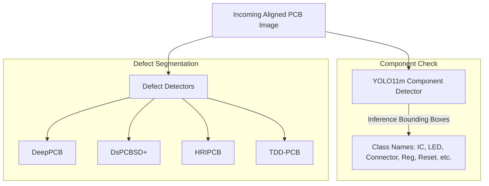

# AI-Based Automated Optical Inspection (AOI) System for PCB Assembly Verification

This document provides a comprehensive technical overview of the Automated Optical Inspection (AOI) system. It is designed to help new developers, software architects, and AI engineers quickly understand the project's goals, technologies, deep learning models, and architecture.

---

## 1. What is this Project?
The **AI-Based Automated Optical Inspection (AOI) System** is a software infrastructure built to verify populated Printed Circuit Board (PCB) assemblies in electronics manufacturing. 

In a production line, high-speed cameras capture images of assembled PCBs. This system automates the verification process by:
- Alingning the captured camera feed to a reference layout.
- Detecting individual components (ICs, LEDs, resistors, connectors, regulators, etc.).
- Verifying component counts, checking for missing items, locating unregistered (extra) components, and evaluating placement alignment in physical millimeters.
- Inspecting solder joints for micro-cracks or fractures.
- Alerting operators on a real-time console and exporting certified quality reports.

---

## 2. What We Have to Do in this Project
The development of this project is divided into two primary parts:

### Part A: Software Engineering Infrastructure (Completed)
- **Industrial UI & State Machine**: Streamlit dashboard console managing lifecycle states (`IDLE`, `PROCESSING`, `COMPLETED`, `ERROR`), configuration sliders, and diagnostic tabs.
- **Verification Engine**: Core math check modules comparing detected coordinates against reference coordinates in physical millimeters ($\text{mm}$).
- **Polymorphic Exporter Factory**: Automated generation of inspection logs in **JSON** (for databases), **CSV** (for logistics), and **PDF** (using ReportLab for print certificates).
- **Template Management**: Pathing and validation configurations for standard profiles (**Arduino Uno**, **ESP32 DevKit**, **STM32 Blue Pill**).
- **Input Validation**: Checkers validating image files, file sizes, configurations, and magic byte headers.

### Part B: Deep Learning & Image Alignment Integration (In Progress)
- **OpenCV Alignment**: Warping the incoming camera feed to a reference coordinate canvas using ORB/SIFT keypoints and homography perspective transformation.
- **Component YOLO Model Integration**: Deploying the trained `component_yolo11m.pt` model to perform real-time bounding box inference.
- **Defect YOLO Models Training**: Training and integrating the 4 defect models to scan solder joints and traces for physical defects.

---

## 3. Technology Stack
The application is built using a lightweight, zero-dependency python architecture:

| Technology | Purpose |
| :--- | :--- |
| **Python 3.12+** | Core programming language |
| **Streamlit** | Industrial operator console dashboard UI |
| **OpenCV (cv2)** | Image preprocessing, homography, and perspective warping |
| **Ultralytics YOLOv11** | Deep learning framework for object detection and segmentation |
| **Pillow (PIL)** | Canvas drawing and image overlays |
| **Pandas & NumPy** | Matrix mathematics and inventory ledger compilation |
| **ReportLab** | PDF generation containing tables, style flows, and branding |

---

## 4. Deep Learning Models to Use
The system utilizes five YOLO models:



### 1. Component Detection Model (`YOLO11m`)
- **weights file**: `models/component_yolo11m.pt` (Already trained on Arduino Uno data).
- **Goal**: Identifies what components are present on the board and extracts their center coordinates ($x, y$), width, and height.
- **Classes**: `battery`, `button`, `buzzer`, `capacitor`, `clock`, `connector`, `diode`, `display`, `fuse`, `heatsink`, `ic`, `inductor`, `led`, `pads`, `pins`, `potentiometer`, `relay`, `resistor`, `switch`, `transducer`, `transformer`, `transistor`.

### 2. Defect Detection Models (Untrained - Fallback Path Active)
Four models will be used to detect solder and trace issues:
- **DeepPCB**: Detects trace-level copper anomalies.
- **DsPCBSD+**: Scans for shorts, spurs, spurious copper, opens, mouse bites, and breakouts.
- **HRIPCB**: Analyzes structural board faults.
- **TDD-PCB**: Detects missing holes and open circuits.

---

## 5. Architectural Pipeline & Flow
The data flows as follows:

```
                  PCB Raw Image Upload
                           │
                           ▼
               [ OpenCV Preprocessing ]
          (Keypoint Detection & Homography)
                           │
                           ▼
                  Aligned PCB Image
                           │
            ┌──────────────┴──────────────┐
            ▼                             ▼
   [ YOLO11m Inference ]        [ Defect Detection ]
    (Component Counting)         (Solder Joint Checks)
            │                             │
            ▼                             ▼
      BBox List & Coords           Defect Indicators
            │                             │
            └──────────────┬──────────────┘
                           │
                           ▼
             [ Core Verification Engine ]
     (Quantity / Alignment / Missing Checkers)
                           │
                           ▼
              Aggregated Inspection Report
                           │
            ┌──────────────┴──────────────┐
            ▼                             ▼
  Streamlit Operator Dashboard   Polymorphic Exporters
  (Visual BBoxes & Ledgers)       (PDF, CSV, JSON Logs)
```

---

## 6. Development Roadmap & Next Steps
For developers looking to continue work on this codebase:
1. **Model Weights**: Locate `models/component_yolo11m.pt` and place it in the `models/` folder. Update the `MODEL_PATHS["Component"]` dictionary inside `detection_engine.py`.
2. **Align Classes**: Review the class names returned by `model.names` of the component detector. If they do not match 1:1 with the expected JSON template component type strings, map them in the `CLASS_NAME_MAP` dictionary inside `detection_engine.py`.
3. **OpenCV Alignment Implementation**: Create a preprocessor module utilizing `cv2.findHomography` and `cv2.warpPerspective` to warp incoming camera images so they match the template's pixel height and width before inference.
4. **Train Defect Models**: Fine-tune YOLO11m segment/detect weights for DeepPCB, DsPCBSD+, HRIPCB, and TDD-PCB, and configure their paths in `MODEL_PATHS` to replace the remaining mock layers.
