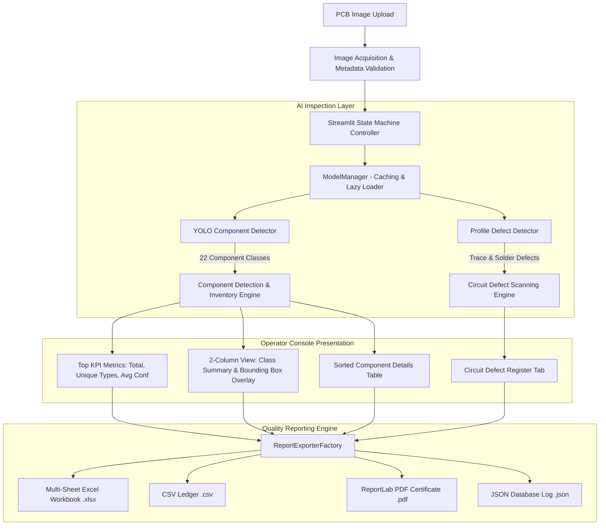

# PCB Automated Optical Inspection (AOI) System - System Architecture & Presentation Reference

This document details the system architecture, dual-engine pipeline flow, software component breakdown, and module integration pathways for the Automated Optical Inspection (AOI) System.

---

## 🏗️ Architectural Style & Principles

The application follows **Clean Architecture** and **SOLID Design Principles**:

- **Domain Models & Templates**: JSON template profiles (`arduino_uno.json`, `esp32_devkit.json`, `stm32_blue_pill.json`, `generic_pcb.json`) defining physical board dimensions ($\text{mm}$), pixel scale factors, and expected component footprint layouts.
- **Deep Learning Inspection Engines**: Isolated engine wrappers (`src/ai/detection_engine.py` & `src/ai/model_manager.py`) orchestrating 5 YOLO object detection models.
- **Verification Engine & Checkers**: Modular algorithmic checkers (`ComponentCounter`, `MissingChecker`, `ExtraChecker`, `PositionChecker`, `CrackChecker`) under `src/inspection/`.
- **Industrial Presenter Console**: Streamlit control panel (`src/app/main.py`) handling real-time UI state transitions (`IDLE`, `PROCESSING`, `COMPLETED`, `ERROR`), KPI cards, responsive data tables, and diagnostic views.
- **Polymorphic Exporter Infrastructure**: Factory pattern exporter (`src/utils/report_exporter.py`) encapsulating multi-sheet Excel, CSV, PDF, and JSON quality log generation.

---

## 📊 System Architecture & Dataflow Diagram

---

## 🔍 Module & Layer Breakdown

### 1. Presentation Layer (`src/app/main.py`)
- Manages operator interactions, profile selection, confidence/IoU threshold sliders, image acquisition cards, KPI cards, visual overlay tabs, and inventory tables.

### 2. AI & Detection Layer (`src/ai/`)
- `detection_engine.py`: Coordinates YOLO component detection and circuit defect scanning pipelines.
- `model_manager.py`: Centralized model manager providing lazy-loading, CUDA GPU detection, session caching, and fallback weights resolution.

### 3. Inspection Checkers Layer (`src/inspection/`)
- Orchestrates placement checking algorithms, physical millimeter displacement calculations ($\text{mm}$), quantity counting, and crack fracture evaluation.

### 4. Exporter Layer (`src/utils/report_exporter.py`)
- Implements the Factory Pattern (`ReportExporterFactory`) to instantiate `ExcelReportExporter`, `CSVReportExporter`, `PDFReportExporter`, and `JSONReportExporter`.

---

## 🚀 Presentation Diagrams & System Specs

### Component Detector Specs
- **Model File**: `models/trained/Component/Component_best.pt`
- **Primary Task**: Component Inventory (`DETECT → IDENTIFY → COUNT → DISPLAY → EXPORT`)
- **Classes Count**: 22 Classes
- **Inference Threshold**: `Confidence = 0.25`, `IoU = 0.45`

### Defect Detector Specs
- **Profile Mappings**:
  - `arduino_uno` $\rightarrow$ `DeepPCB` (`DeepPCB.pt`)
  - `esp32_devkit` $\rightarrow$ `DsPCBSD+` (`DsPCBSD+.pt`)
  - `stm32_blue_pill` $\rightarrow$ `HRIPCB` (`HRIPCB.pt`)
  - `generic_pcb` $\rightarrow$ `TDD-PCB` (`PDD-PCB-best.pt`)
- **Primary Task**: Solder joint fracture & copper trace anomaly scan

