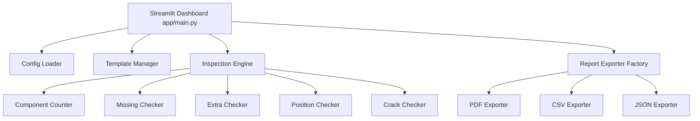

# PCB Automated Optical Inspection (AOI) System - Architecture Guide

This guide outlines the system's clean architecture and lists concrete pathways for integration of future modules (YOLO11m, OpenCV, FastAPI, Database, live feed, etc.).

## Architectural Style
The project adheres to **Clean Architecture** and **SOLID Principles**:
- **Entities/Models**: Represented by JSON templates (e.g. `arduino_uno.json`) defining physical characteristics of the board.
- **Use Cases/Checks**: Isolated under the `inspection/` folder (e.g., `MissingChecker`, `PositionChecker`). They only implement comparison logic without importing UI frameworks.
- **Controllers/Presenters**: Handled by Streamlit (`app/main.py`) which acts as the operator's control panel.
- **Frameworks/Drivers**: File system configurations, exporters, and logs.

---

## Future Integrations Roadmap

### 1. YOLO11m & YOLO11m-Seg Models
- **Where to Integrate**: Replace the mock implementation in `mock/mock_results.py` with an actual detection wrapper class `YoloDetector` (e.g. inside `models/yolo_wrapper.py`).
- **OpenCV Alignment**: Implement a preprocessing step in `utils/preprocessor.py` utilizing OpenCV `findHomography` and `warpPerspective` to align incoming camera images with the template dimensions before passing them to the YOLO model.

### 2. FastAPI Interface
- **Where to Integrate**: Create a new folder `api/` with `api/routes.py` and `api/server.py`.
- **Methodology**: Move the `InspectionEngine` call inside a POST endpoint `/inspect` that accepts image files and returns the unified JSON results payload. The Streamlit dashboard can then act as a lightweight client querying the FastAPI server over HTTP/WebSockets.

### 3. Database Layer (MongoDB / PostgreSQL)
- **Where to Integrate**: Create `db/database.py` and `db/models.py`.
- **Methodology**: Use SQLAlchemy (for PostgreSQL) or Beanie/Motor (for MongoDB) to persist inspection logs. Instead of exporting CSV files locally, write the inspection payload directly to the database. The dashboard can then pull history records for analytics graphs.

### 4. Live Camera & MQTT Integration
- **Where to Integrate**: Create `utils/camera_feed.py` and `utils/mqtt_client.py`.
- **Methodology**:
  - Live Feed: Use OpenCV `VideoCapture` inside a background thread to poll frames from a USB/IP camera.
  - MQTT: Trigger a camera snapshot via MQTT signals from a PLC (Programmable Logic Controller) on the physical assembly line conveyor belt, then run the inspection engine, and report back status via MQTT.

### 5. Docker & Cloud Deployment
- **Where to Integrate**: Write a `Dockerfile` and `docker-compose.yml` in the project root.
- **Methodology**: Build a Docker image containerizing Streamlit and FastAPI. Deploy onto AWS (ECS or EKS) or Google Cloud Run, utilizing GCP Cloud Storage buckets for raw board image logging.
